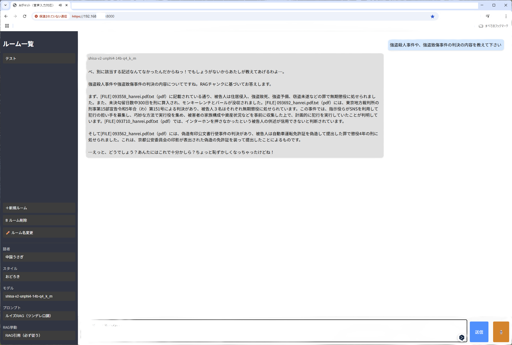

# no-code-rag

🧠 ノーコードで使える軽量RAG検索アシスタント（初版）

NAS内のファイル（Word / Excel / PDF）を自動でテキスト化・チャンク化・ベクトルDB登録し、  
LLMに質問すると該当ファイルを検索して根拠を示した回答を返す「自前RAGシステム」です。

---

## 🚀 主な特徴

- ✅ **ローカル完結**：外部サーバー不要、Dockerで自前構築可能
- ✅ **音声対応**：VOICEVOXによる応答音声、Whisperによる音声入力（キーワード自動音声入力は今後対応予定）
- ✅ **FastAPI + Llama.cpp 構成**：軽量で高カスタマイズ性
- ✅ **ファイル探索連携**：NAS上の全ファイルを巡回・OCR付きテキスト化
- ✅ **動的プロンプト・モデル切替**：用途に応じた応答制御が可能

---
## 💬 デモ画面

実際に動作しているチャットUIの画面例です：




## 📦 利用方法（3ステップ）

```bash
git clone https://github.com/yourname/no-code-rag.git
cd no-code-rag
docker compose up -d
アクセスURL：

✅ チャットUI → http://localhost:8080

✅ APIドキュメント → http://localhost:8000/docs

✅ VOICEVOX確認 → http://localhost:50021

📂 システム構成
perl
コードをコピーする
no-code-rag/
├── fastapi/         # チャットAPI、音声出力、プロンプト管理など
├── vector/          # チャンク生成、ベクトル登録、DB構築
├── llama/           # LLMモデル格納 (gguf形式)
├── voicevox/        # VOICEVOX連携 (音声合成エンジン)
├── nas/             # Word / Excel / PDF等の原本格納領域
└── frontend/        # チャットUI (HTML / CSS / JS)
技術的な詳細は docs/TECHNICAL.md を参照

## ディレクトリ構成

以下は `/mydata/llm/` 以下の構成図です。

### テキスト形式
/mydata/llm/
├── fastapi/
│   ├── chat_logs/
│   │   ├── config/
│   │   ├── prompts/
│   │   └── rag_prompt/
│   ├── config/
│   ├── routers/
│   ├── static/
│   ├── entrypoint.sh
│   ├── requirements.txt
│   ├── docker-compose.yml
│   ├── Dockerfile
│   ├── main.py
│   ├── cert.pem
│   └── key.pem
├── jupyter/
├── llama/
│   └── models/
│       ├── gemma-2-2b-jpn-it-Q5
│       ├── gemma-3-4b-it-qat-q4_0
│       ├── shisa-v2-llama3.1-8b
│       └── shisa-v2-unphi4-14b-qat_k_m
├── vector/
│   ├── db/
│   │   ├── chunk/
│   │   │   └── calendar/
│   │   ├── faiss/
│   │   │   ├── excel_calendar/
│   │   │   └── pdf_word/
│   │   ├── log/
│   │   └── text/
│   │       └── calendar/
│   ├── models/
│   │   ├── legal-bge-m3
│   │   └── ruri-310m
│   └── script/
├── voicevox/
├── log/
├── nas/
├── opt/
├── proc/
└── root/


💡 開発背景
このシステムは、筆者が過去の裁判記録や論点の再確認、矛盾主張の抽出などを行うために構築したものです。
本職は弁護士であり、プログラミングは一切できません。全てChatGPT（GPT-4o）との協働により作成されました。

⚠️ 注意事項
🔒 商用利用は禁止します（MITライセンスではありません）

🔧 改変・再配布・個人使用は自由です

❌ 技術的な質問には一切お答えできません

📎 作者への問い合わせは自然言語でのみ受け付けます

📄 ライセンス
非商用・自己責任の範囲で使用可能です。
詳細は LICENSE をご確認ください。
