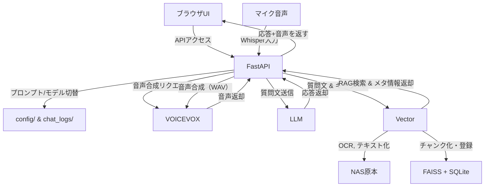
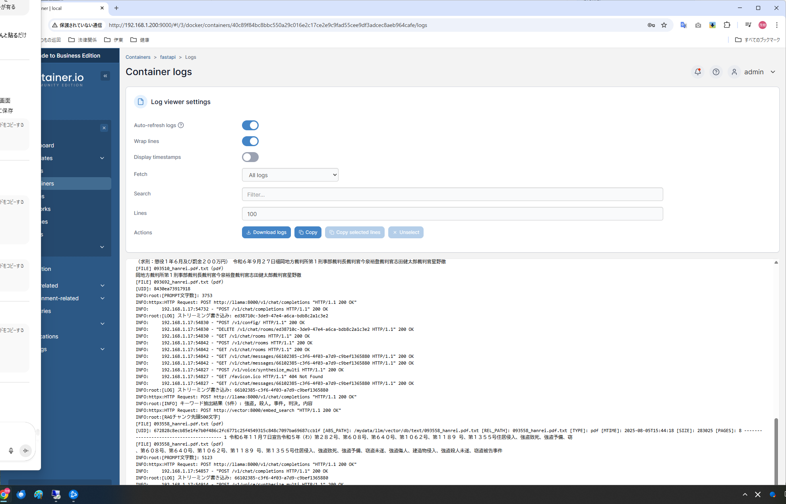

# 技術資料 - TECHNICAL.md

## 第１章　プロジェクト概要

本システムは、NAS上の各種ファイル（Word / Excel / PDF / Calendar）を自動的に探索・OCR・テキスト化・チャンク化し、FAISS＋SQLiteベースのベクトルDBに登録、質問に対してRAG検索＋LLM応答を提供する構成となっている。システム全体はDockerコンテナで分割運用され、音声入力・音声出力・UI連携・モデル切替・プロンプト編集まで対応している。

---

## 第２章　全体構成図（簡略）

```
no-code-rag/
├── fastapi/         # 中枢：FastAPI + UI + 音声制御（firstAPI）
├── vector/          # ベクトルDB構築・OCR・チャンク処理
├── llama/           # LLM推論（llama-cpp-python）
├── voicevox/        # VOICEVOX（音声合成）
├── jupyter/         # 開発用Jupyter（検証・試行）
├── nas/             # 原本格納（Word/PDF/Excel）
├── log/             # UIDログ・削除ログなど
└── frontend/        # HTML / CSS / JS（静的UI）
```

---

## 第３章　コンテナ別 技術構成

### 🔹 fastapi（firstAPI）

- Pythonベース、FastAPIによる中枢統括
- 音声出力、プロンプト切替、モデル制御を集約
- 使用ライブラリ：fastapi, uvicorn, httpx, pydantic, python-dotenv, tiktoken, faster-whisper, webrtcvad, sounddevice, pydub, pyaudio
- Whisperベース音声入力とVOICEVOX出力を両対応
- UIとの統合は `/static/` 以下のJS・CSSで実現

### 🔹 vector（ベクトル処理）

- OCR処理：pytesseract / ocrmypdf / pdf2image
- Office処理：python-docx / openpyxl / xlrd / pandas / natsort
- ベクトル化：sentence-transformers / faiss-cpu
- カレンダー連携：google-api-python-client / icalendar / icalevents
- UID/チャンク/削除ログの自動管理に対応

### 🔹 llama（推論）

- llama-cpp-python による gguf モデル推論
- transformers / sentencepiece によるトークナイズサポート
- CPU環境でも高速推論可能
- ポート8001で FastAPI 経由で呼び出し

### 🤖 使用している LLM モデル（推論用）

本システムでは、Llama.cpp によるローカル推論のため、GGUF形式の量子化済みモデルを使用しています。

| モデル名 | 保存パス | 形式 | 説明 |
|----------|----------|------|------|
| `gemma-3-4b-it-qat-q4_0` | `/mydata/llm/llama/models/gemma-3-4b-it-qat-q4_0/` | GGUF（q4_0） | 軽量4bit量子化モデル |
| `shisa-v2-unphi4-14b-q4_k_m` | `/mydata/llm/llama/models/shisa-v2-unphi4-14b-q4_k_m/` | GGUF（q4_k_m） | 高精度4bit量子化モデル |

> モデルファイル（`*.gguf`）は事前にHugging Faceなどから取得して `/models/` に配置する必要があります。

### 🔹 voicevox（音声合成）

- voicevox_engine:cpu-ubuntu20.04-latest の公式Dockerイメージ使用
- ポート50021で動作、fastapiから音声生成APIとして利用

### 🔹 jupyter（検証用）

- jupyterlab / notebook / ipykernel による開発環境
- `/workspace` 内で make_chunk.py 等の手動実行・検証が可能

---

## 第４章　使用技術一覧（分類別）

| 分類 | 技術・ライブラリ |
|------|------------------|
| 🧠 LLM推論 | llama-cpp-python, transformers, sentencepiece |
| 🔎 ベクトルDB | FAISS + SQLite |
| 🧪 API基盤 | FastAPI, uvicorn, pydantic, httpx |
| 🧠 埋め込み | sentence-transformers, huggingface_hub |
| 📄 OCR | pytesseract, ocrmypdf, pdf2image, PyMuPDF |
| 📊 Office処理 | python-docx, openpyxl, pandas |
| 📅 カレンダー連携 | google-api-python-client, icalendar |
| 🗣 音声処理 | faster-whisper, webrtcvad, VOICEVOX |
| 🎤 音声入力 | sounddevice, pyaudio |
| 📁 補助系 | tqdm, numpy, scikit-learn, orjson |

---

## 第５章　備考・免責

- 技術的な質問は受け付けておらず、自然言語による問い合わせに限定します。
- 本システムはすべてChatGPT支援のもと、非エンジニア（弁護士）によって開発されました。
- 商用利用は禁止されています。ライセンスは `LICENSE` を参照。

---

## 第２章補足　システム構成図（テキストベース）



### 🔍 RAGログの例（Portainer）




> ※ `Jupyter` は本流には接続せず、開発検証用として `vector/`, `db/`, `log/` 等を読み取り・操作可能なスタンドアロン構成となっています。

### 🧠 使用している埋め込みモデル

本システムでは、チャンクのベクトル化に以下の日本語対応埋め込みモデルを使用：

| モデル名 | 保存場所 | 形式 | 備考 |
|----------|----------|------|------|
| `legal-bge-m3` | `/mydata/llm/vector/models/legal-bge-m3/` | SentenceTransformers形式（safetensors） | 法務文書向け日本語モデル |
| `ruri-310m`    | `/mydata/llm/vector/models/ruri-310m/`    | SentenceTransformers形式 | 軽量・バックアップ用モデル（現在は未使用） |

> モデルは Hugging Face などから事前に取得して配置する必要があります。
> `/models/` ディレクトリは `.gitignore` により Git 管理から除外されています。
